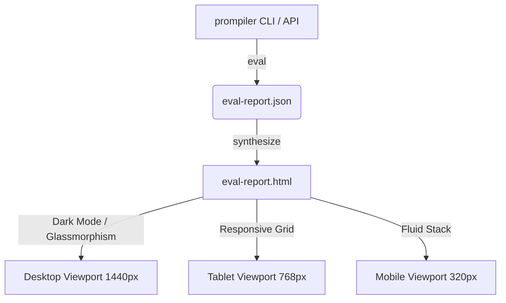

# Product Design & Development Management Review: prompiler


### 1.1 dependency-groups & Build Config Audit (`pyproject.toml`)
*   **Hatchling backend**: `tool.hatch.build.targets.wheel` correctly points to `src/prompiler`.
*   **Strict target runtime**: Restricted to `requires-python = ">=3.11,<3.12"`, which prevents runtime issues with Python 3.10 and ensures compatibility with Pydantic v2.
*   **CLI Entry Point**: Registered as `"prompiler" = "prompiler.cli:main"` (line 23).
*   **Linter configurations**: Strict mypy rules (`strict = true`, `warn_return_any = true`) and comprehensive ruff rules are correctly declared.

### 1.2 Local Test Gate Audit (`scripts/local_test.py`)
Running `python3 scripts/local_test.py` now executes successfully without crashing, but yields **2 FAILURES** and **2 SKIPS**:

1.  **`cli --help` [FAIL]**: Aborts with `ModuleNotFoundError: No module named 'prompiler.cli'`. The CLI entry point is defined in `pyproject.toml` but the file `src/prompiler/cli.py` or directory `src/prompiler/cli/` is not yet present.
2.  **`compile examples` [SKIP]**: Skipped because `examples/` directory does not yet exist.
3.  **`MCP /healthz` [FAIL]**: Fails to bind within 10 seconds because the CLI server command does not exist.
4.  **`structured logging` [SKIP]**: Skipped due to lack of `examples/` directory.

> [!NOTE]
> **P0 Skeleton Gap**:
> To complete Phase P0, skeleton modules for the CLI (`cli/main.py` or `cli.py`) and the MCP server (`mcp/server.py`) must be created to satisfy the import requirements of the CLI wrapper and local test scripts.

---

## 2. Product Design & UX Review

### 2.1 UI/UX Aesthetics & Design System



*   **CLI UX**: The CLI outputs must be styled. We recommend using a library like `Rich` to print side-by-side colorized diffs when running `prompiler refine`.
*   **Static Report Design (`eval-report.html`)**: The requirement for a zero-framework, static page under 200 kB is excellent for performance. The page must be designed with modern CSS variables to achieve a dark-mode theme, crisp typography (e.g., Google Fonts Inter/Outfit), and clear alignment to satisfy the Lighthouse accessibility target ($\ge 95$).

### 2.2 Full-Stack Architecture & Portability

```
┌────────────────────────────────────────────────────────┐
│                   prompiler.compile()                  │
└──────────────────────────┬─────────────────────────────┘
                           │
      ┌────────────────────┼────────────────────┐
      ▼                    ▼                    ▼
┌───────────┐        ┌───────────┐        ┌───────────┐
│  Prompt   │        │ Pydantic  │        │  Backend  │
│ Synthesizer│       │  Class    │        │ Tool Spec │
└─────┬─────┘        └─────┬─────┘        └─────┬─────┘
      │                    │                    │
      ▼                    ▼                    ▼
[invoice.prompt.txt] [In-Memory Model]   [invoice.claude.json]
```

*   **Static Type Check Leakage**: The runtime dynamically creates Pydantic classes using `pydantic.create_model()`. While flexible, this dynamically created class is not visible to IDE linters or `mypy` in consumer applications, leading to `Any` typed models and a degraded developer experience (DX).
*   **JSON Schema Degradation (`degrade.py`)**: Different LLM backends implement JSON Schema to varying degrees:
    *   *Claude*: Lacks native support for regex `pattern` validation.
    *   *OpenAI*: Does not support `decimal` or complex custom formats.
    *   *Gemini*: Restricts schema nesting depth.
    
    The degradation pipeline must drop these keywords cleanly and move their validation logic into the dynamically compiled system prompt instructions to prevent silent validation failures.

### 2.3 Mathematical & Algorithmic Rigor

#### A. Deterministic Hashing
The `spec_hash` is computed as:
$$\text{spec\_hash} = \text{SHA-256}(\text{canonical\_yaml}(\text{spec}) \mathbin{\Vert} \text{prompiler\_version})$$

*   *Critique*: Appending `prompiler_version` to the hash is a strict quality gate, but it means that minor patches or minor bumps of the `prompiler` package will invalidate all existing spec hashes in reports and cached outputs, even if the spec files themselves are identical.

#### B. Evaluation Metric Formulas
The metrics engine calculates Precision ($P$), Recall ($R$), and F1-score ($F_1$) over extraction tasks:
$$P = \frac{TP}{TP + FP}, \quad R = \frac{TP}{TP + FN}, \quad F_1 = 2 \cdot \frac{P \cdot R}{P + R}$$

For nested arrays of objects (e.g., invoice line items), matching is set-based against a designated `key` field (e.g., `description`).
*   *Edge Case*: If the key field contains slight semantic variations (e.g., `"10x Widget"` vs. `"10x Widgets"`), exact matching treats this as a complete failure (F1 = 0), neglecting the correct extraction of numbers and prices. A fallback bipartite matching algorithm based on a similarity threshold should be introduced.

### 2.4 Security Threat Model & Mitigations

| Risk ID | Threat | Description | Mitigation Strategy |
| :--- | :--- | :--- | :--- |
| **S1** | Untrusted YAML Parsing | YAML parsing can trigger arbitrary code execution via unsafe constructors. | Use `yaml.safe_load` exclusively. Lint rule enforces this. |
| **S2** | Constraint DSL RCE | Users write math constraints which are evaluated using Python internals. | Parse via `ast.parse` and whitelist operators. **Audit**: Ensure no attributes start with double underscores (`__`) to prevent class sandbox escape. |
| **S4** | MCP Server Over-exposure | MCP server binds to public interface (`0.0.0.0`) by default. | Bind to `127.0.0.1` by default. Issue a warning inside Docker containers where `0.0.0.0` is required. |
| **S6** | Secret Leaks in Cassettes | API credentials captured in playback cassettes. | A three-tier redaction pipeline: Header filtering, JSON Path scrubbing, and regex fallbacks for known vendor token schemas. |

---

## 3. Development Management & QA Gating

The plan defines a linear sequence of phases from project foundation (P0) to release (P8).

```mermaid
gantt
    title prompiler Phase Gate Lifecycle
    dateFormat  X
    axisFormat %d
    section Development
    P0: Foundation         :active, p0, 0, 7
    P1: Compilation Core   : p1, after p0, 14
    P2: Backend Adapters   : p2, after p1, 14
    P3: Runtime & Registry : p3, after p2, 7
    P4: Eval Harness       : p4, after p3, 10
    P5: Refinement Loop    : p5, after p4, 7
    P6: MCP Server         : p6, after p5, 7
    P7: CLI & Obs          : p7, after p6, 7
    P8: Release & Docs     : p8, after p7, 10
```

### 3.1 Gating Rules Audit

The project specifies strict commit and push policies:

1.  **Pre-Commit Hook (`.pre-commit-config.yaml`)**: Runs `ruff`, `mypy`, and unit tests (requiring $\ge 80\%$ code coverage).
2.  **Commit Message Hook (`scripts/check_lesson_cite.py`)**: Rejects any commit starting with `fix:` or `perf:` unless it references an entry in `docs/LESSONS_LEARNT.md` (e.g., `Applying LL-007`) or has a valid `Lesson-skip: <reason>` trailer ($\ge 10$ characters).
3.  **Pre-Push Hook (`scripts/check_clean_tree.py`)**: Refuses push if the working tree has uncommitted modifications.

> [!IMPORTANT]
> **Developer Velocity Trade-off**:
> The `check_lesson_cite.py` hook maintains code quality, but enforcing it during the early prototyping phases (P0 to P2) can slow down iteration. Trivial bug fixes (like resolving typos or file path issues) require writing placeholder lessons or verbose skip reasons.

---

## 4. Alternative Architectural Solutions

### 4.1 Dynamic Class Synthesis vs. Static Code Generation
*   **Dynamic (Current)**: Generates Pydantic classes at runtime using `create_model()`.
    *   *Pros*: Elegant, zero filesystem pollution.
    *   *Cons*: IDE autocomplete fails; static type-checking engines cannot verify return signatures.
*   **Static Code Generation (Alternative)**: The compilation step (`prompiler compile`) writes actual Python files (e.g., `.prompiler/compiled/invoice.py`) to disk, which are then imported by the runtime.
    *   *Pros*: Full static IDE support, auto-complete, and clean mypy checks.
    *   *Cons*: Files must be regenerated on spec updates.

### 4.2 Set-Based Evaluation vs. Semantic Bipartite Matching
*   **Set-Based (Current)**: Match items exactly using a unique key field.
    *   *Pros*: Low computational cost, simple to implement.
    *   *Cons*: Fails on free-text differences or slight formatting changes.
*   **Bipartite Matching (Alternative)**: Compute a similarity matrix between predicted and expected objects using Cosine Similarity on text embeddings, and apply the Hungarian algorithm to pair elements.
    *   *Pros*: Tolerates minor spelling or phrasing variations.
    *   *Cons*: Requires a local or external embedding model.

---

## 5. Implementation Roadmap (Next Steps)

To complete the remainder of Phase P0 (Foundation) and proceed to Phase P1 (Spec & Compilation Core):

- [ ] **1. Create CLI Stub**
  Write a basic Typer CLI skeleton at `src/prompiler/cli.py` or `src/prompiler/cli/main.py` with standard --help descriptors.
- [ ] **2. Create MCP Serve Stub**
  Add the stdio/HTTP server skeleton in `src/prompiler/mcp/server.py` or equivalent binding logic to serve `/healthz` returning `200 {"status": "ok"}` on localhost.
- [ ] **3. Verify Local Test Pass**
  Run local tests using `uv run python3 scripts/local_test.py` or `.venv/bin/python3 scripts/local_test.py` and ensure `cli --help` and `MCP /healthz` checks pass.
- [ ] **4. Build example directories**
  Add `examples/` directory and populate it with initial YAML spec templates (`invoice.yaml`, `email_category.yaml`) to enable `compile examples` tests.
- [ ] **5. Launch Phase P1 Start Gate**
  Run the Phase Start Gate code review for Phase P1 as required by `RULES.md` §6.
